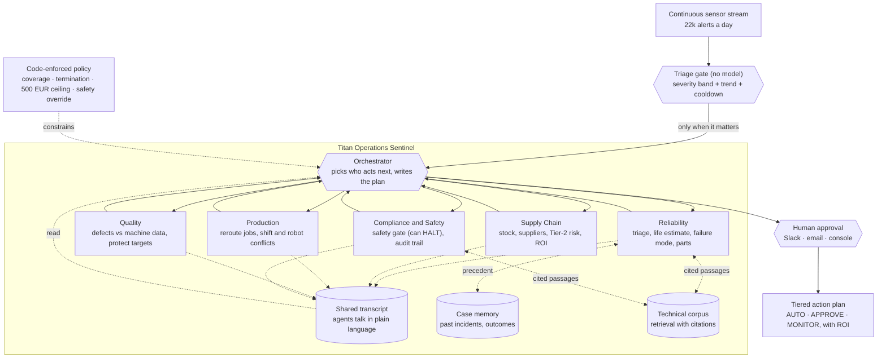

# Titan Operations Sentinel

**A multi-agent LangGraph system that turns one factory sensor alert into a costed, safety-gated action plan.**

[](https://github.com/ma731/titan-operations-sentinel/actions/workflows/tests.yml)
[](https://github.com/ma731/titan-operations-sentinel/actions/workflows/eval-nightly.yml)
[](eval/results/scorecard.md)
[](LICENSE)

**[Open the live demo](https://ma731.github.io/titan-operations-sentinel/)** · [Evaluation scorecard](eval/results/scorecard.md) · [Open findings](eval/FINDINGS.md) · [Architecture](#architecture)

> The demo runs in Replay mode: a recorded run played back in the browser. No API key, no
> cost, nothing to install. The console labels it as a recording rather than passing it off
> as live.

---

## The problem in one paragraph

A Titan plant produces more than 22,000 alerts a day. Exactly one of them, on a Friday
afternoon, is a spindle bearing about to fail on a machine worth 180,000 EUR a day. Finding
it is a triage problem. Responding to it is not: the response needs the maintenance team,
the supply chain, production scheduling, quality and safety to agree inside a few hours,
and today each of them sees only its own slice. A dashboard shows you the data. A rules
engine follows fixed steps. Neither reasons across the silos, which is the actual job.

## What it does

```
22,431 alerts   ->  triage  ->  1 alert worth waking six agents for
                                   |
                                   v
       reliability -> supply chain -> production -> quality -> compliance
        (what is      (what does it   (who makes    (is the    (is any of
         failing,      cost to fix     the parts     backup     this legal
         how long)     in time)        instead)      safe)      and safe)
                                   |
                                   v
                   human approves anything over 500 EUR
                                   |
                                   v
            [AUTO] throttle + reroute   [APPROVE] rush order + window
            [MONITOR] vibration          full audit trail, run saved to memory
```

## Numbers

| | |
|---|---|
| Evaluation | **98.2%** across **166** offline checks, **27** labelled scenarios ([scorecard](eval/results/scorecard.md)) |
| Safety gate | **100%** recall on the HALT class, 0 missed halts, 1 known false positive ([F-02](eval/FINDINGS.md)) |
| Routing guarantee | verified over **every** path the policy permits, not a sampled run |
| Retrieval | recall@4 **100%** on direct queries, **41.7%** on paraphrases (52 labelled queries) |
| Triage gate | 240 readings produce **1** agent run: a 0.4% wake rate |
| Cost of a full run | about 18k tokens, 0 EUR on a free tier |
| Tests | **131** offline, no API key required |

Every number above is produced by `python -m eval.run_eval` or `python -m pytest`, not
typed into this file by hand. Where the system disagrees with its own documentation, the
[findings register](eval/FINDINGS.md) says so instead of the label being edited to match.

---

## Run it

```bash
docker compose up --build       # console on :5173, API on :8000, no key needed
```

Or without Docker:

```bash
pip install -r requirements.txt
python scripts/run_demo.py              # the Friday Cascade, end to end
python -m stream.run                    # continuous alert stream, triage only, no tokens
python -m eval.run_eval                 # regenerate the scorecard
python -m pytest tests/                 # 131 offline tests
```

The five specialist agents need a real tool-calling model. Drop any supported key in
`.env` (Gemini and Groq are free), or point `TOS_MODEL` at a local Ollama model. Routing
and synthesis degrade to a labelled template with no provider at all, so the graph, the
tools, the retrieval layer and the tests all run offline.

---

## Architecture



The load-bearing idea is the split between the two kinds of decision:

- **The model decides** who acts next, what each assessment says, which tools to call, and
  how the final plan reads. That is judgement, and it is what an agent is for.
- **Code decides** what the model is allowed to choose from. `policy.py` guarantees that
  every cross-domain agent runs on a high-risk event, that the run terminates, that
  spending above 500 EUR reaches a human, that a safety HALT overrides everything, and
  that thin data produces an abstention rather than a confident guess.

So the system is autonomous but cannot run away, and the guarantees are testable without
a model. `eval/policy_eval.py` verifies the routing guarantee by enumerating every path
the policy permits, rather than watching one run and hoping.

---

## My contribution

This is a five-person group project. What I (Marco Ortiz Togashi) built, so you can ask me
about the right things:

**Owned end to end**

- **Orchestration** (`graph.py`, `policy.py`). Replaced the initial skeleton with the
  LangGraph supervisor: the shared transcript, agent-to-agent `FOLLOWUP` messaging bounded
  by `MAX_VISITS`, the routing policy, the code-enforced 500 EUR ceiling with the
  fit-to-window test, structured verdicts read from tool fields rather than prose, and the
  deterministic abstention path that spends no tokens when the telemetry cannot be trusted.
- **Evaluation harness** (`eval/`). The 27 labelled scenarios, the 52 labelled retrieval
  queries, the metrics, the exhaustive routing verification, the generated scorecard and
  the findings register.
- **Retrieval** (`rag/`). The corpus, the section chunker, the BM25 implementation, the
  optional embedding layer, hybrid fusion, and the recall@k evaluation.
- **Web console** (`webapp/`). The React and FastAPI console: the live orchestration
  graph, SSE streaming, the approval gate UI, the learning view, run history, provider
  switching, and the slide deck.
- **Model layer** (`llm.py`). Provider-agnostic factory with auto-detection, retry and
  backoff for free-tier limits, and the offline fallback.
- **Learning loop**. Case-memory write-back and the self-closing reconcile step.
- **Observability, the alert stream and the approval integrations**
  (`observability.py`, `stream/`, `integrations/`), CI, and Docker.

**Built by teammates**

- Marian Garabana: the initial project skeleton, the case study document, and the risk and
  architecture trade-off write-ups.
- David Carrillo: the first pass of the domain tools and their LangChain wrappers, the
  simulated datasets, and the original agent and prompt scaffolding.
- Nuria Diaz: the system-prompt overhaul across all five specialists.
- Ignacio Moreno: presentation and demo preparation.

`git log` backs this up, and the commit history is readable if you want to check.

---

## The agents

| Agent | Challenge | Decides | Key tools |
|-------|-----------|---------|-----------|
| Orchestrator | coordination | who acts next, and the final tiered plan | routing only |
| Reliability | 1 | which alert matters, remaining life, failure mode, parts, precedent | `alert_triage`, `sensor_query`, `rul_predictor`, `recall_similar_cases`, `asset_profile`, `search_technical_docs` |
| Supply Chain | 2 | the parts gap, the best option by ROI, hidden Tier-2 risk | `parts_inventory`, `supplier_catalog`, `expedite_cost`, `tier2_supplier_risk` |
| Production | 3 | how to reroute jobs without a staffing or robot conflict | `job_reroute`, `robot_cell_status`, `shift_conflict_check` |
| Quality | 4 | whether the fault is causing defects, and whether the backup machines are safe | `quality_history`, `telemetry_correlate` |
| Compliance and Safety | 5 | check every action against OSHA (can HALT), build the audit trail | `safety_gate`, `audit_assemble`, `search_technical_docs` |

The agents decide, the tools act. Tools fetch data, do arithmetic, or draft documents.
They never make a decision or commit anything irreversible.

Every agent is a LangGraph `create_react_agent`: its own model picks which of its tools to
call and loops until it is done. Agents communicate by appending their full report to one
shared transcript that every later agent reads, and an agent may end with
`FOLLOWUP: <agent> — <question>` to put a direct question to another specialist.

---

## Grounding: retrieval with citations

The Reliability and Compliance agents can query a technical reference corpus and must cite
the section they relied on.

- **The corpus** (`rag/corpus/`) is 12 documents, 78 section-level chunks: fleet
  maintenance standards, and plain-language paraphrases of OSHA 1910.147 and 1910.212,
  ISO 10218 and ISO/TS 15066, ISO 10816-3 and IATF 16949. Every document declares its
  provenance, so an agent citing a paraphrase can tell that it is a paraphrase.
- **The retriever** (`rag/`) is BM25 by default, which needs no key and no network.
  Embeddings are opt-in through `TOS_EMBEDDINGS` and fuse with BM25 by reciprocal rank.
- **The measurement** (`eval/rag_eval.py`) reports recall@k, MRR and precision@k for each
  retriever over 52 labelled queries, split into two difficulty bands.

The split is where the interesting number is:

| Split | Queries | recall@4 (lexical) | MRR |
|---|---:|---:|---:|
| direct (uses the document's own vocabulary) | 40 | 100% | 0.969 |
| paraphrase (deliberately avoids it) | 12 | 41.7% | 0.322 |

That gap is the case for embeddings, measured rather than asserted. Set `TOS_EMBEDDINGS`
and the scorecard fills in the dense and hybrid rows; without it they are reported as
"not configured" rather than quietly falling back to lexical and being labelled hybrid.

**This is separate from case memory.** `recall_similar_cases` matches past incidents in a
structured JSON library. That is case-based memory, not retrieval over documents. Both are
useful, they are different things, and this README keeps them apart on purpose.

---

## Evaluation

The full scorecard is at [`eval/results/scorecard.md`](eval/results/scorecard.md) and is
regenerated by `python -m eval.run_eval`. Three suites, separated by what they cost:

| Suite | Cost | What it measures |
|---|---|---|
| **Offline policy** | free, no key, deterministic | risk classification, the approval gate, safety verdicts, action tiering, terminal status, and routing coverage over every permitted path |
| **Retrieval** | free, no key, deterministic | recall@k, MRR, precision@k per retriever and per difficulty split |
| **Live agents** | tokens | tool-call correctness, routing coverage, gate decisions, citation rate, tokens, cost and latency on an 8-scenario subset |

The first two run in CI on every push with `--fail-under 0.97`, so the scorecard is a gate
and not a decoration. The live suite runs nightly when a provider key is available.

Two things worth knowing about how it is built:

1. **The routing guarantee is verified exhaustively.** `enumerate_routing_paths` walks
   every sequence the policy allows and asserts the coverage, ordering and termination
   properties on all of them. This is how the suite found that a low-risk run could finish
   without ever passing the safety gate, which no demo had ever done but the policy
   permitted ([F-03](eval/FINDINGS.md)).
2. **Misses are documented, not edited away.** The scorecard is at 98.2%, not 100%. The
   gap is two open findings, each written up with why it has not simply been patched to
   green. A suite that always reports 100% is either measuring nothing or being tuned to
   the answer.

---

## Autonomy and safety

| Tier | Example actions | Who approves |
|------|-----------------|--------------|
| AUTO | throttle within OEM limits, reroute jobs, update logs, draft a work order | nobody, the agent acts |
| APPROVE | any purchase, or an emergency maintenance window | plant manager, through the gate |
| ESCALATE | anything touching a safety system | safety officer |

- **The 500 EUR ceiling is enforced in code.** An option runs autonomously only if it is
  at or under the ceiling *and* fits the failure window. An unknown cost is not a small
  cost, and a cheap part that arrives after the machine fails is a decision about
  accepting the failure, which belongs to a person.
- **A Compliance HALT overrides everything**, including an approved spend and an urgent ROI.
- **It abstains on thin data.** If the telemetry drops out, Reliability refuses to invent a
  life estimate and the run escalates for manual inspection. That path is deterministic
  and spends zero tokens.
- **It fails toward caution.** A failed agent becomes a recorded error, and a Reliability
  failure sets risk to HIGH.

---

## Autonomous operation

```bash
python -m stream.run                        # triage only, no model calls
python -m stream.run --live --interval 2    # actually run the agents, paced for a demo
python -m stream.run --dropout CNC-07-LEI   # watch a telemetry feed die mid-degradation
```

A seeded fleet simulator emits readings every tick. A cheap deterministic triage gate
decides what is worth waking six agents for: it scores against the documented severity
bands, treats a change from baseline as its own wake condition, and enforces a per-machine
cooldown so a machine that is degrading for hours does not start a run every tick. Over a
default window: **240 readings, 1 agent run, a 0.4% wake rate.**

A telemetry dropout on a machine already above threshold is its own wake condition and
routes to the escalation path. A healthy machine going quiet is an instrumentation ticket,
not an operations event.

Spending model tokens to decide whether to spend model tokens is how an autonomous system
quietly becomes expensive, so the gate is deliberately free.

---

## Human approval, outside the app

When the gate trips, the request goes to whoever is configured:

- **Slack**: a Block Kit message with Approve and Reject buttons. Callbacks are signature
  verified with a replay window, and the button carries the run id, so a late click on an
  old message resolves the run it belongs to.
- **Email**: an SMTP message with two links, for when installing a Slack app is not an option.
- **Console**: the default, and what the web console uses.

All three resolve through the same `/api/decision` path, so a run has one resume path and
one audit record however it was approved. Nothing in the integration decides anything: it
carries a question to a person and carries the answer back.

---

## Observability

Per-agent token, cost and latency tracking is built in (`observability.py`) and is what
the scorecard reports efficiency from. It needs no account and works offline, which
matters: a cost figure that only exists when a SaaS is reachable is not a cost figure.

Set `LANGFUSE_PUBLIC_KEY` and `LANGFUSE_SECRET_KEY` to additionally send traces to
Langfuse for a per-agent waterfall. Both are off by default and neither can break a run.

---

## The learning loop

Perceive, reason, act, learn, without retraining anything.

| Part | Status | What it does |
|---|---|---|
| Case memory recall | live | `recall_similar_cases` pulls the closest past case (predicted vs actual life, the decision, the outcome) into the Reliability agent |
| Write-back | live | every finished run is appended to `data/memory/case_library.json` with its predicted window |
| Outcome validation | live, self-closing | `reconcile_due()` runs at the start of each cycle and closes any case whose outcome is now known, updating life-estimate accuracy |
| Reflection and signature down-weighting | design stage | the `self_eval` prompt scores each plan today; replaying those critiques and down-weighting signatures that miss is the planned next step, and is labelled "design" in the console |

---

## The web console

```bash
cd webapp/frontend && npm install && npm run dev     # Replay: free, no key, cannot fail
python -m uvicorn main:app --app-dir webapp/backend --port 8000   # adds Live mode
```

Live orchestration graph with animated routing, the three scenario paths, the approval
gate, an agent chat, the learning view, the plant fleet inspector, cost and feasibility,
the audit log, run history with Markdown export, presenter auto-play, a command palette, a
Replay/Live toggle, an in-app provider picker, and the slide deck at `/deck.html`. Details
in [`webapp/README.md`](webapp/README.md).

The backend exposes `/api/run` (SSE), `/api/decision`, `/api/decision/link`,
`/api/slack/interactions`, `/api/providers`, `/api/config` and `/api/health`. The health
endpoint reports what is actually wired up: the active provider, the approval channel, the
retrieval mode, the corpus size and the policy constants.

---

## Providers

Provider-agnostic through `init_chat_model`. Switch by setting `TOS_MODEL`, by dropping a
key in `.env`, or from the console's picker.

| Provider | Prefix | Key | Notes |
|---|---|---|---|
| Gemini | `google_genai:` | `GEMINI_API_KEY` or `GOOGLE_API_KEY` | free tier, most headroom for a full run |
| Groq | `groq:` | `GROQ_API_KEY` | free and fast; use `llama-3.3-70b-versatile` |
| OpenRouter | `openrouter:` | `OPENROUTER_API_KEY` | one key, many free models; best when another tier rate-limits |
| Azure OpenAI | `azure_openai:` | `AZURE_OPENAI_API_KEY` plus endpoint and version | paid-tier limits; model name is the deployment name |
| OpenAI, Anthropic, Mistral | `openai:`, `anthropic:`, `mistralai:` | the matching key | paid or free tiers |
| Ollama | `ollama:` | none | fully local, no key |

---

## Repository layout

```
graph.py              orchestration: supervisor, workers, shared transcript, approval gate
policy.py             the code-enforced decision rules (coverage, ceiling, safety, abstention)
observability.py      per-agent tokens, cost, latency; optional Langfuse tracing
llm.py                provider-agnostic model factory
audit_log.py          JSONL audit trail
agents/               the 5 specialist ReAct agents
tools/                20 domain tools plus the @tool wrappers (docs/tool_catalog.md)
rag/                  technical corpus, BM25 + optional embeddings, cited retrieval
eval/                 labelled datasets, metric suites, generated scorecard, findings register
stream/              fleet simulator, triage gate, the continuous loop
integrations/         Slack and email approval routing
prompts/              5 agent prompts plus supervisor, orchestrator, guardrails, self-eval
data/                 simulated scenario data for all five challenges, plus case memory
webapp/               React console and FastAPI SSE backend
scripts/              run_demo.py, view_run.py
tests/                131 offline tests
docs/                 brief, case study, tool catalog, architecture, appendix pack
```

---

## Design choices

- **Why many agents, not one.** Five focused agents with about four tools each make better
  tool choices than one agent juggling twenty, and they match the org silos the case study
  is about joining up.
- **Why the policy is in code.** Coverage, termination, the spend ceiling and the safety
  override are promises. A promise that depends on the model happening to choose well is
  not a promise, and it cannot be tested cheaply.
- **Why simulated data.** Real SCADA and SAP integration needs OT access and months of
  pipelines. The tools read realistic JSON shaped like production systems, so the agent
  behaviour is representative even though the data is not real.
- **Honest labelling.** The heuristic life estimate, the Replay recording, the design-stage
  learning parts, the corpus provenance and the open evaluation findings are all labelled
  as what they are, in the code, the docs, the console and the deck.

---

## Status and limitations

- Working: all five challenges, the learning loop, the audit trail, the web console, the
  retrieval layer, the continuous stream, the approval integrations, CI, and 131 offline
  tests.
- The remaining-life estimate is a heuristic, not a trained model. It is an MVP stub and is
  labelled as one. [F-01](eval/FINDINGS.md) records a real threshold inconsistency in it
  that the evaluation found.
- The safety keyword list is broader than the rule it implements, which costs HALT
  precision. It is measured, written up in [F-02](eval/FINDINGS.md), and deliberately not
  loosened without the team, because narrowing a safety rule is not a lint fix.
- Reflection replay and automatic signature down-weighting are designed, not live.
- The retrieval corpus is small and clean, so the direct-split recall says the corpus is
  well separated rather than that retrieval is solved. The
  [findings register](eval/FINDINGS.md) lists the suite's own blind spots.

---

## Docs

[`docs/`](docs/) and [`docs/appendix/`](docs/appendix/): the prompt pack, the tool catalog,
the risk matrix and FMEA, the confidence policy, the sequence diagram and audit log schema,
why an agent rather than a dashboard, the evidence checklist against the assignment rubric,
the anticipated-questions pack, and the recording guide.

## Team

IE University, MBDS, Agentic AI for IT, Team 3. Presented 24 June 2026.
Marco Ortiz Togashi, David Carrillo Aguilera, Nuria Diaz Jimenez, Marian Garabana Garrido,
Ignacio Agustin Moreno.

Licensed MIT.
